# Fundamentos de Ingeniería de Software
# Obligatorio 2
___Versión 1.0___

**N4A, Docente: Gerardo Quintana, Martín D'Uva**

**Integrantes: Cristian Palma, Valeria Vera, Federico Alonso.**

23 de noviembre de 2020

**URL del repositorio: https://github.com/ORT-FIS-202008/ob2-ort-fis-obl2-alonso-palma-vera**

# ÍNDICE

### 1. [PREFACIO](#I1)
### 2. [GLOSARIO](#I2)
### 3. [PROCESO DE BUILD](#I3)
- ### 3.1. [Clonar el Repositorio](#I31)
- ### 3.2. [Instalar la Aplicación](#I32)
### 4. [CALIDAD DE CÓDIGO](#I4)
- ### 4.1. [Código en JavaScript](#I41)
- ### 4.2. [Código en HTML y CSS](#I42)
### 5. [PRUEBAS UNITARIAS](#I5)
### 6. [INTERFAZ DE USUARIO](#I6)
- ### 6.1. [Evaluación de la Usabilidad](#I61)
  - ### 6.1.1 [Análisis Heurístico](#I611)
  - ### 6.1.2 [Pruebas con Usuarios](#I612)
- ### 6.2. [Evaluación de la Accesibilidad](#I62)
### 7. [TESTING FUNCIONAL](#I7)
- ### 7.1. [Generación de Casos de Prueba](#I71)
- ### 7.2. [Pruebas exploratorias](#I72)
- ### 7.3. [Ejecución de Casos de Prueba](#I73)
### 8. [REPORTE DE DEFECTOS](#I8)
### 9. [TRABAJO DEL EQUIPO](#I9)
### 10. [REFLEXIÓN](#I10)

# 1. PREFACIO 

El presente repositorio cuenta con la aplicación solicitada por el obligatorio, así como con el estudio de funcionalidad, usabilidad, testing e interfaz de usuario desarrollado a partir de la misma.

Se compone de una estructura de carpetas, en las que se encuentra todo lo necesario para implementar la misma, se desarrolla el procedimiento en la sección [Proceso de build](#I3). Como pasos previos para el mismo se debe tener instalado en el ordenador nodejs y git.

Las tecnologías utilizadas son SCSS, Javascript y HTML, generando cuatro páginas estáticas, las cuales no poseen persistencia de datos y cada una de ellas tiene datos precargados para simular el funcionamiento de la aplicación.

# 2. GLOSARIO 

Se especifíca la terminología utilizada a lo largo del documento:

- *Software:* Conjunto de programas que permiten a la computadora realizar determinadas tareas
- *Usuario*: Persona que utiliza el sistema.
- *Responsive*: Diseño de página web que se adapta de forma automática a la resolución de la pantalla donde está siendo visualizado y a diferentes tipos de dispositivos.
- *Plataforma:* Sistema que permite la ejecución de diversas aplicaciones bajo un mismo entorno, dando a los usuarios la posibilidad de acceder a ellas a través de Internet.
- *Caso de uso:* Secuencia de transacciones que son desarrolladas por un sistema en respuesta a un evento que inicia un actor sobre el propio sistema.
- *Diagrama de casos de uso:* Diagrama que muestra la relación entre los actores y los casos de uso en un sistema.
- *Requerimiento:* Condición o capacidad de un sistema requerida por el usuario para resolver un problema o alcanzar un objetivo.

# 3. PROCESO DE BUILD 

A continuación se detallan los pasos a seguir para ejecutar la aplicación en un entorno local.

## 3.1. Clonar el Repositorio 

Acceder en el navegador a la [Ruta del Repositorio](https://github.com/ORT-FIS-202008/ob2-ort-fis-obl2-alonso-palma-vera).

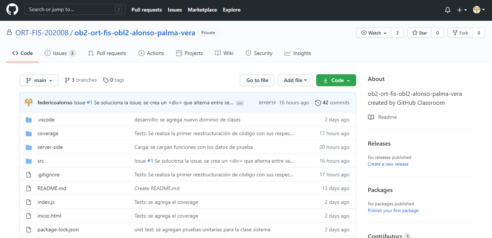

Copiar la ruta para clonar el mismo.

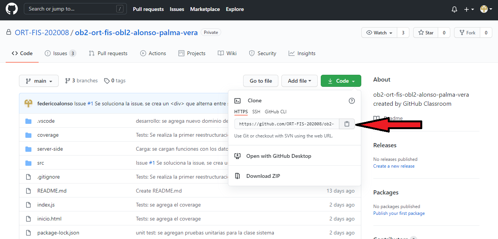

En una nueva carpeta en el ordenador personal, hacer click derecho con el mouse y seleccionar "Git Bash Here".

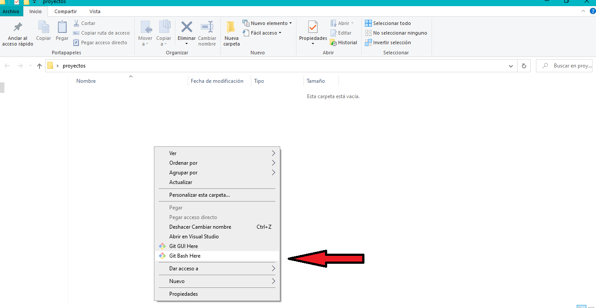

Introducir el comando:

    - git clone https://github.com/ORT-FIS-202008/ob2-ort-fis-obl2-alonso-palma-vera

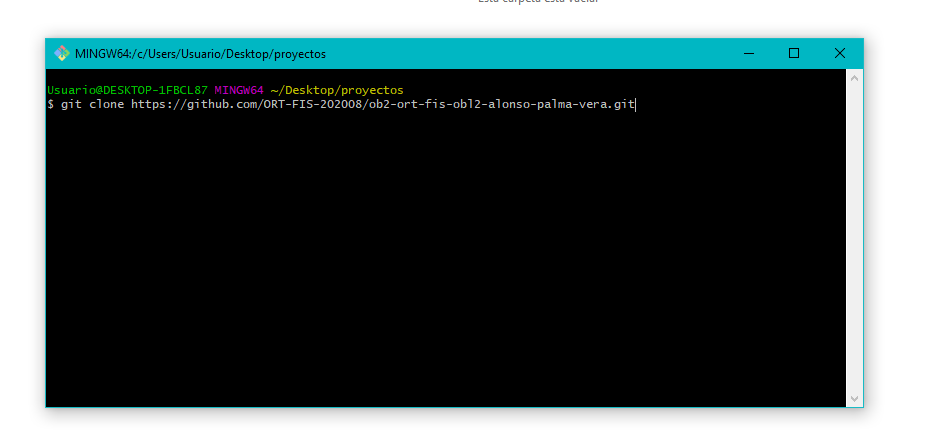

Acceder a la carpeta creada con el siguiente comando:

    - cd ob2-ort-fis-obl2-alonso-palma-vera

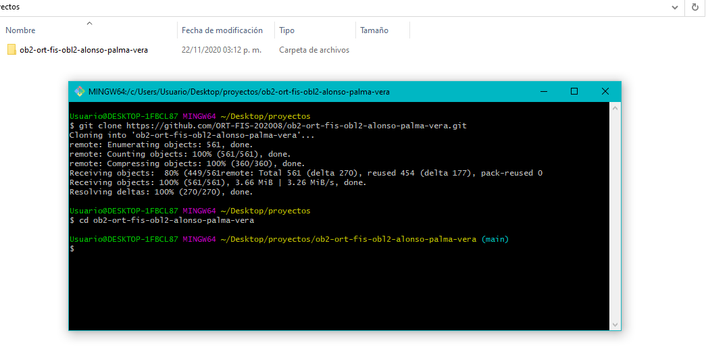

## 3.2. Instalar la Aplicación 

Una vez posicionados en la carpeta se debe correr el comando:

    - npm install

Se entiende que ya se tiene instalado nodejs en el ordenador, de lo contrario se debe realizar con anterioridad, por más información visitar [el sitio oficial de nodejs](https://nodejs.org/es/).

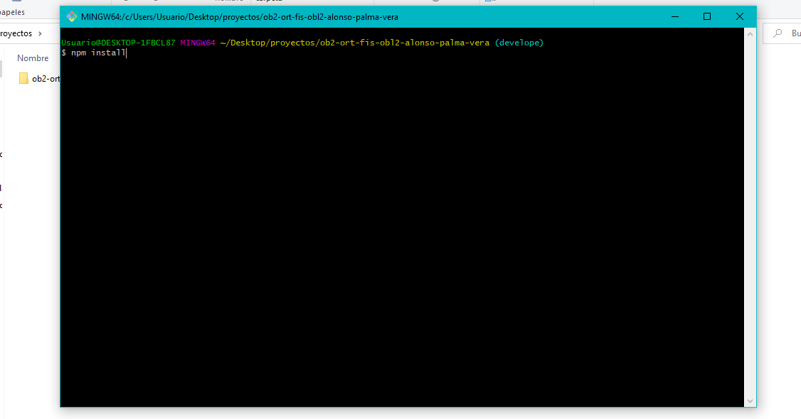

Luego de la instalación de dependencias, se procede con la actualización de los archivos .js. 

Este proceso sirva para que la aplicación funcione con normalidad sin necesidad de levantarla desde un servidor, además de no tener la necesidad de utilizar archivos de clase distintos para correr las pruebas jest. 

Se debe aplicar el siguiente comando:

    - npm run start

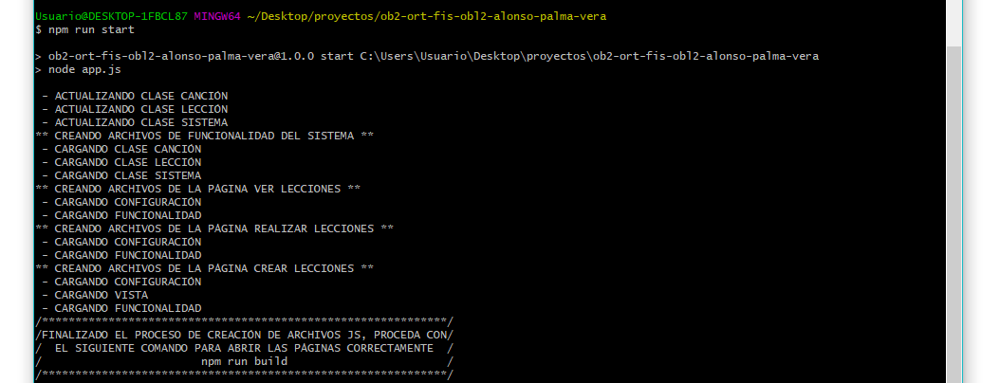

Después se aplica webpack para minificar los archivos, por lo que mejorará el rendimiento de la aplicación, se debe aplicar el siguiente comando:

    - npm run build

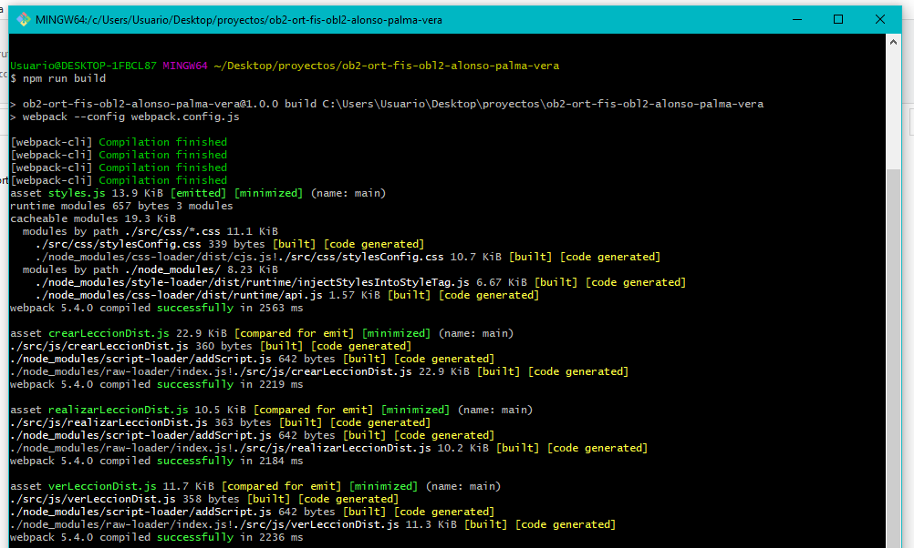

Para finalizar se accede a la carpeta y se hace doble click sobre el index.html

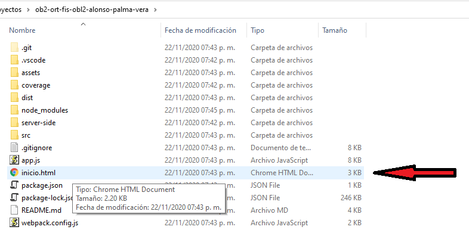

# 4. CALIDAD DE CÓDIGO 

El equipo estableció que el estándar de codificación sea el de Google:

[Estandar de google](http://google.github.io/styleguide/), tanto para HTML/ CSS, como para JavaScript.

De esta manera, facilitó el trabajo en equipo, ya que se hizo más fácil leer el código de todos los integrantes del grupo.

Una de las técnicas utilizadas para mejorar la calidad del código consistió en la revisión de código, por cuestiones de tiempo el primer objetivo deseado fue tener la estructura de la página funcionando en detrimento de la calidad del código, pero de esta forma pudimos dividirnos mejor el trabajo, lo cual nos permitió trabajar en paralelo en el testing exploratorio, y la revisión de código y así asegurar el cumplimento de los estándares antes mencionados, para los cuales según la tecnología de desarrollo se encaró de distintas maneras:

## 4.1. Código en JavaScript

Además, concordamos en utilizar las siguientes herramientas que nos fueron de ayuda para aplicar estos estándares:

- Plugin de VsCode: [JSHint](https://jshint.com/docs/options/)
- Para mejorar el Formateo, vimos que la documentación de Google recomendaba [clang-format](http://clang.llvm.org/docs/ClangFormatStyleOptions.html)

El plugin clang-format nos ayudó a detectar bastantes errores como por ejemplo:

- Indentación.
- Sangría.
- Wspacios en blanco.
- Mal uso de “var” para variables, sugiriendo usar “let” y “const” para los casos que la variable no tenía ninguna reasignación del valor.
- Uso de comillas simples para String.
- Estructuras de control, abertura y clausura.

Cabe aclarar, que fue ignorada la recomendación que sugería eliminar el punto y coma al final de cada sentencia, pero que si era recomendado por el plugin JsHint.

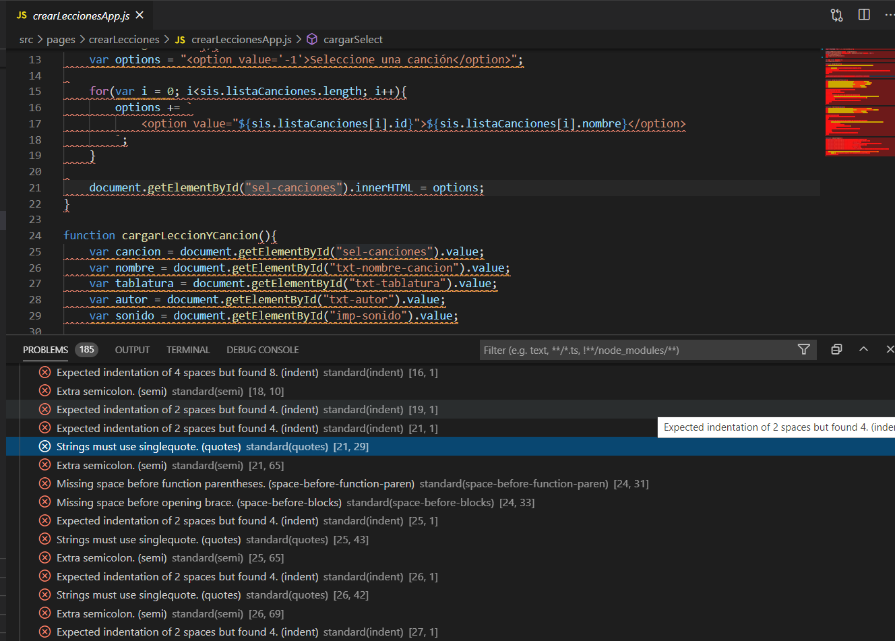

## 4.2. Código en HTML y CSS 

Además, concordamos en utilizar las siguientes herramientas que nos fueron de ayuda para aplicar estos estándares:

Como herramienta para la validación del código HTML y CSS, subimos nuestro código al siguiente sitio [validador](https://validator.w3.org/#validate_by_upload), obteniendo los siguientes resultados:

- en la página crearLecciones.html

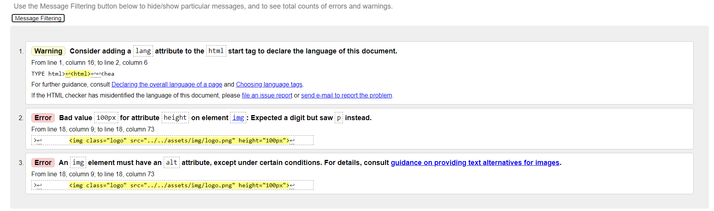

- en la página realizarLección.html

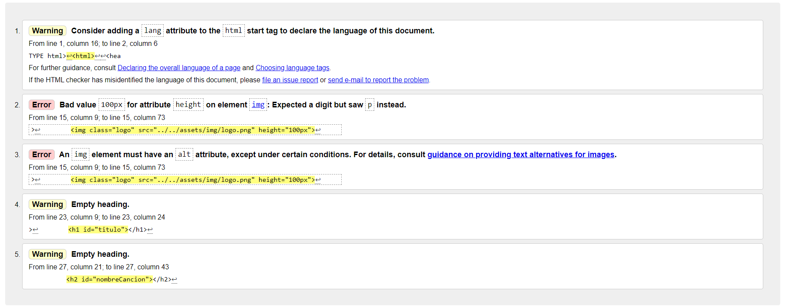

- en la página verLecciones.html 

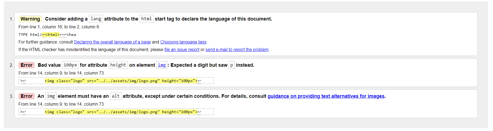

- Validación del css en [jigsaw.w3.org](https://jigsaw.w3.org/css-validator/)

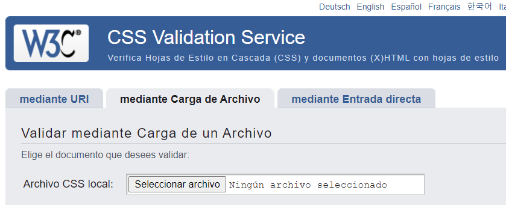

- En el archivo stylesConfig.css

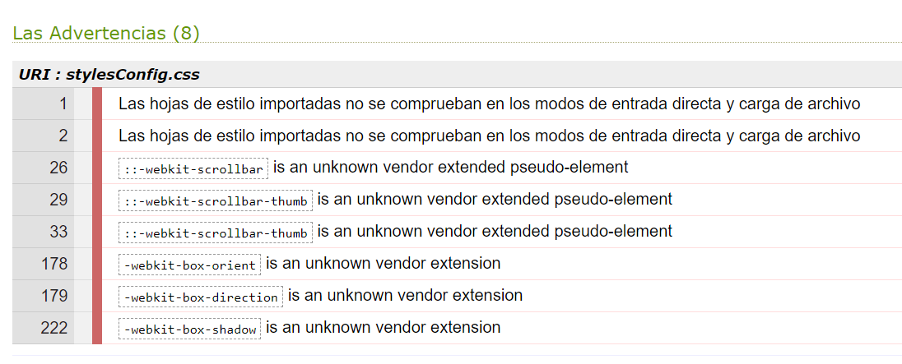

# 5. PRUEBAS UNITARIAS 

Se configuran pruebas unitarias para el proceso de detección de errores en el dominio del sistema creado. La herramienta utilizada para el procedimiento es jestjs (para mayor información visitar su [sitio oficial](https://jestjs.io/)).

El detalle de lo realizado con la aplicación de la herramienta se encuentra en el [estudio de pruebas unitarias](src/tests/README.md).

Para correr las prebas unitarias sobre el sistema, se debe aplicar el comando:

    - npm run test

El resultado del mismo es una cobertura del 100% de las funciones. y un 100% de las líneas de código.

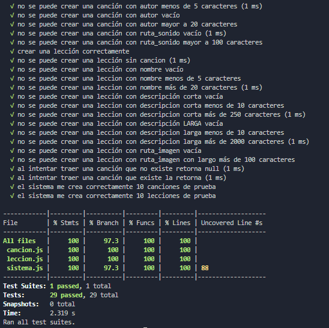

Como aprendizaje se obtuvo que es más fiable contar con la herramienta, se verifica que al momento de realizar cambios en la aplicación o reestructura de código, se tiene el respaldo de las pruebas para corroborar que el código sigue funcionando como corresponde, por lo que el trabajo realizado una única vez ahorra tiempo de pruebas a futuro.

# 6. INTERFAZ DE USUARIO 

Para hacer el desarrollo de la interfaz de usuario, clasificamos en primera instancia cuales páginas iban a ser utilizadas por los niños (*realizarLeccion.html* y *verLeccion.html*) y por otra parte la página en la cual iba a ser utilizada por un adulto, quien tiene la responsabilidad de subir el contenido a la página (*crearLecciones.html*).

El foco principal en esta primera versión fue hacer lo más fácil posible el uso de la aplicación, tomando las siguientes métricas para su posterior evaluación:

- Tiempo de aprendizaje (el niño debe ser capaz la primera vez que ingresa al sitio de poder llegar a la página de realizar una lección en un tiempo menor o igual a 2 minutos).
- Velocidad de operación (desde la página de *inicio.html*, en dos clicks el niño ya puede ver la lección).

Respecto a la página de *crearLecciones.html*, la medición se hizo en el siguiente aspecto:

- Tiempo de aprendizaje. (el adulto debe ser capaz la primera vez que utiliza la aplicación, de poder crear una nueva lección en el sistema en un tiempo menor o igual a 5 minutos).

En cuanto a la accesibilidad del sistema, por factor tiempo que contamos para el desarrollo de la aplicación, se decidió no hacer énfasis en este aspecto, pero si documentar las mejoras que eventualmente se podrían tomar en cuenta para desarrollar a futuro, para la cual utilizamos una herramienta llamada [“AChequer”](https://achecker.ca/checker/index.php), la cual hace un chequeo de verificación de los estándares [WCAG 1.0](https://www.w3.org/TR/WAI-WEBCONTENT/) y [WCAG 2.0](https://www.w3.org/TR/WCAG20/), en todos sus niveles: 

- Perceptible.
- Operable.
- Comprensible.
- Robusto.

En nuestro proyecto, utilizamos [“Bootstrap”](https://getbootstrap.com/docs/4.1/getting-started/introduction/) con los siguientes objetivos:

- Hacer una página web con diseño responsivo.
- Como equipo nos pareció rápido de aprender a usar.
- Ser consistentes en todo el proyecto con el mismo estilo de diseño.

## 6.1. Evaluación de la usabilidad 

Para lograr este objetivo utilizamos las siguientes técnicas:

- Análisis Heurístico.
- Pruebas con usuarios.

### 6.1.1. Análisis heurístico 

Para evaluar la usabilidad de la interfaz utilizamos las heurísticas de Nielsen, entre los miembros del equipo nos repartimos las heurísticas a analizar realizando una inspección de la interfaz para evaluar la calidad de la misma a partir del cumplimiento de los principios heurísticos. Se utilizan los principios heurísticos de Nielsen por ser los más reconocidos universalmente.

Resultado del Análisis:
 
1. Principio visibilidad del estado del sistema: 

**NO CUMPLE** -Se ejecuta el sistema y se observa que no se mantiene a los usuarios informados sobre lo que ocurre, a través de una retroalimentación apropiada. Se despliegan mensajes de error poco específicos que no le indican al usuario el problema que ha ocurrido y como solucionarlo, en la página cuando el alumno se encuentra realizando una lección, no se sabe en que punto de la navegación nos encontramos.

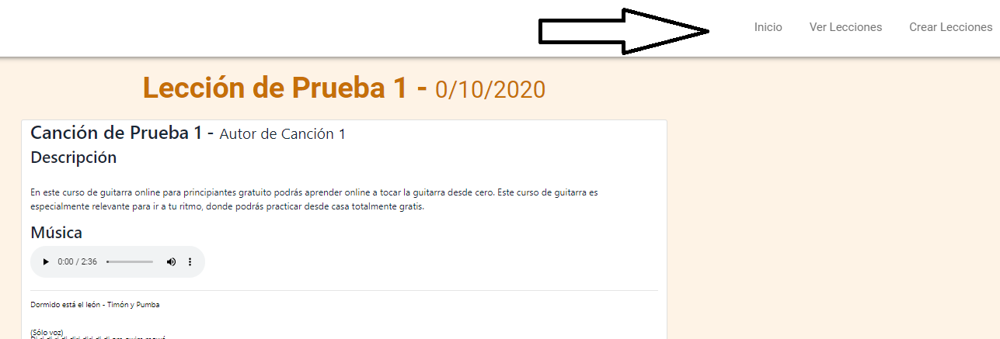

2. Empate entre el sistema y el mundo real: 

**CUMPLE** -El lenguaje es conocido para el usuario, no se encontró algún concepto complejo para la compresión de un niño (en las páginas -*realizarLeccion.html* y *verLeccion.html*)

3. Control y libertad del usuario:

**NO CUMPLE** -El sistema no contiene una ‘puerta de emergencia’ para salir del estado indeseado, es decir no ofrece soporte para deshacer y rehacer acciones, esto se puede notar en la función de crear lección, una vez confirmada esta acción, no se puede deshacer, y ni siquiera el sistema ofrece la posibilidad de eliminar una lección existente.

4. Consistencia y estándares: 

**CUMPLE** -Se utiliza en todo el documento los estándares de clases de Bootstrap, manteniendo el documento homogéneo en cuanto a tamaño de botones, colores, fuente, entre otras. Si bien se utilizan clases especiales en ciertas ocaciones, estas no varían los estándares de Bootstrap.

5. Prevención de errores:

**NO CUMPLE** -No se informan las características que debe tener cada campo a completar en la pantalla crear lecciones (tipo de texto, largo máximo y mínimo). Los errores son reportados luego de haber sido cometidos al querer crear una lección con algún error.

6. Reconocimiento mejor que recuerdo: 

**NO APLICA** -El usuario no debe recordar la información de una parte del diálogo a otra. Cada pantalla contiene la información necesaria para ser utilizada sin excederse para que el usuario no tenga un sobrecargo de información.

7. Flexibilidad y eficiencia de uso:

**NO APLICA** -No se utilizan aceleradores y teclas con funciones específicas ya que por el alcance del proyecto es muy básica la funcionalidad a desarrollar, no se diferencias usuarios principiantes y expertos.

8. Diseño estético y minimalista:

**CUMPLE** -El sistema es muy básico, no contiene información irrelevante. El diseño es intuitivo y sencillo. 

9. Ayudar a reconocer, diagnosticar y recuperarse de errores: 

**CUMPLE** -Los mensajes de error informan exactamente el motivo por el cual no se pudo realizar una acción indicando con exactitud el error en cuestión. Esto se aplica en la página de *crearLeccion.html*, ya que es en la única donde el usuario puede cometer un error.

10. Ayuda y documentación: 

**NO CUMPLE**- No se provee ayuda y documentación para el usuario. 

Conclusiones del Análisis heurístico:

Se puede apreciar en el análisis heurístico que menos de un tercio de las heurísticas se cumplen, por lo que no se puede asegurar la usabilidad del sistema. Deberán implementarse diversas mejoras en el diseño en futuras versiones para así lograr el objetivo deseado. La principal causa de que no se puedan cumplir con la mayoría de las heurísticas se debe al factor tiempo que se dispone para realizar el desarrollo del sitio.

### 6.1.2 Pruebas con usuarios 

Del documento referente a las [pruebas con usuarios](docs/APV-ob2-TestingConUsuarios-2020.md) concluye que, luego de realizar las pruebas a dos usuarios externos al equipo, se detectaron errores significativos.

De la primera prueba, se verificó que generar el entorno es muy importante, no sólo debemos ponerlos en situación, sino que también brindarle las herramientas que un usuario de ese estilo tendría en dicha situación, por lo que para la segunda prueba no sólo les leímos la situación, sino que también le brindamos los recursos necesarios y definiciones como tablatura y clase de guitarra.

Además solucionamos de la primer prueba a la segunda errores importantes en el sistema, que no sólo provocaban que el usuario se confunda, sino que también generaban una mala experiencia. Por más que sea sencilla la aplicación, se encontraron varios errores, la gran parte en la primera prueba (errores en navegación, confusión en cuanto a guardar canciones, confusión con el llenado de los campos, etc), en la segunda prueba se "pulieron" los errores, generando errores como el de la tablatura o el de definir bien dónde se crean las canciones por parte del usuario, errores que podrían ser subsanados en una siguiente etapa.

Se tomó conciencia de la importancia de las pruebas con usuarios, debido a la restricción de tiempo sólo se pudo hacer con dos usuarios, pero se notó un cambio importante luego de subsanar los defectos que dió la primera prueba.

## 6.2 Evaluación de la Accesibilidad 

Para evaluar la accesibilidad, se subieron los archivos html en la página [“AChequer”](https://achecker.ca/checker/index.php).

El reporte dio los siguientes problemas:

1. Falta de texto alternativo en imagenes (1.1.1 Non-text Content (A))

2. Falta de etiquetas, falta adaptabilidad (1.3.1 Info and Relationships (A))

3. No esta definido el lenguaje del documento (3.1.1 Languaje of Page (A))

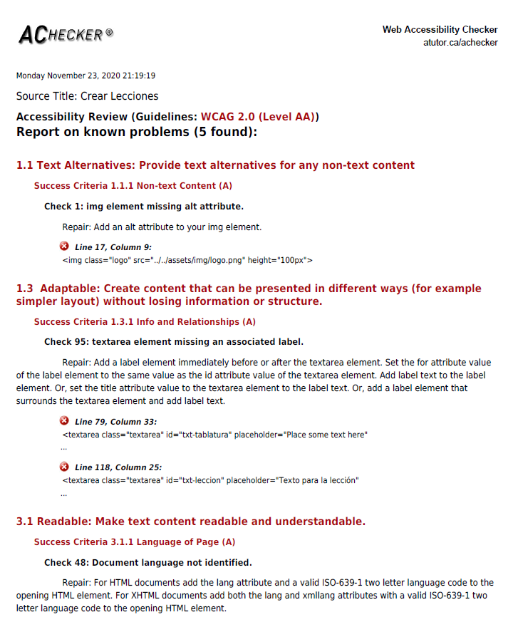

### Reporte Accesibilidad Página Crear Lecciones
[documento](docs/APV-ob2-AnalisisAccesibilidadCrearLecciones-2020.pdf)

### Reporte Accesibilidad Realizar Lecciones
[documento](docs/APV-ob2-AnalisisAccesibilidadRealizarLeccion-2020.pdf)

### Reporte Accesibilidad Página Ver Lecciones
[documento](docs/APV-ob2-AnalisisAccesibilidadVerLecciones-2020.pdf)

# 7. TESTING FUNCIONAL 

Para el desarrollo de esta etapa, se utilizaron técnicas de prueba de caja negra, los casos de prueba se derivaron de la especificación del programa.

Se ejecutaron sesiones de testing exploratorio como primera instancia para familiarizarse con el sistema y encontrar la mayor cantidad de defectos y mejoras de usabilidad.

Para la planificación se utilizó la técnica **Pruebas de caso de Uso** 

En esta segunda instancia se realiza una suite de pruebas, para cubrir los aspectos más funcionales del sistema. Se construyen las suites aplicando a partir de los casos de uso del sistema y se aplica el método de clases de equivalencia para lograr una cobertura mayor del sistema en general.

## 7.1 Generación de Casos de Prueba 

El detalle de lo realizado con la aplicación de la herramienta se encuentra en el [Planificación de casos de prueba](/docs/README.md).

## Casos de prueba para crear lección

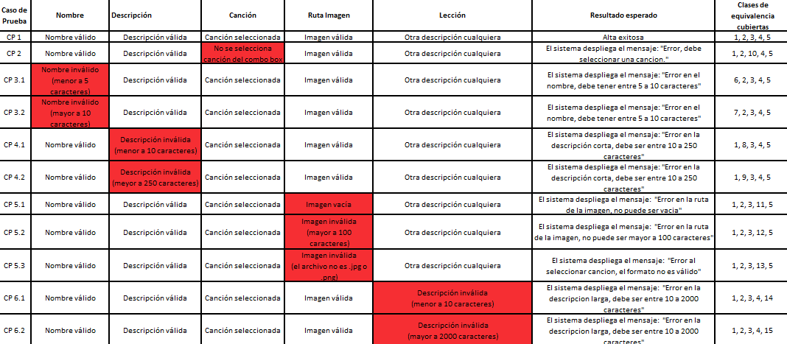

## Casos de prueba para crear canción

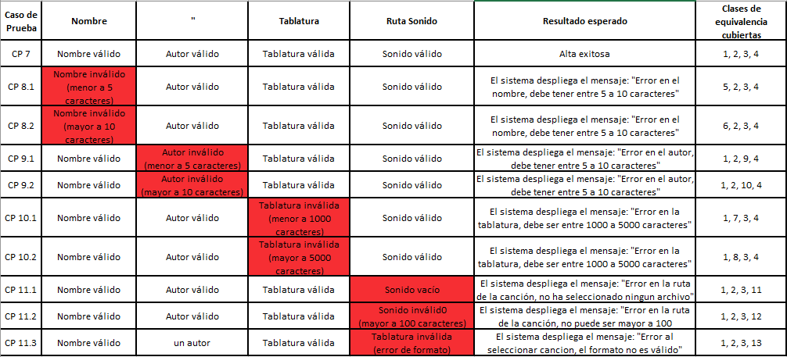

## Casos de prueba para realizar lección

## 7.2 TESTING EXPLORATORIO 

Se realizan cuatro sesiones de testing exploratorio debido a que el sistema es muy extenso por lo que no sería posible abarcarlo en una sola instancia y para permitirle a todos los integrantes del equipo familiarizarse con la interfaz.

### Primera sesión de testing exploratorio

Como resultado de esta sesión se reportaron los siguientes issues en git:

1. El diseño de la interfaz en la página de inicio no es responsive, la interfaz no se adapta y diferentes dispositivos.
**GitHub Issue#2**

2. El color del hover de la pantalla de inicio no pasa las pruebas de contraste, es muy claro.
**GitHub Issue#3**

[Sesión de test exploratorio 1](docs/APV-ob2-1erTestingExploratorio-2020.pdf)

### Segunda sesión de testing exploratorio

Como resultado de esta sesión se reportaron los siguientes issues en git:

1. El color de fondo y letra del botón tomar lección no coincide con el del resto de la interfaz.  **GitHub Issue # 10**

2. El título “Descripción” debe decir “Instructivo” **GitHub Issue #4**

[Sesión de test exploratorio 2](docs/APV-ob2-2doTestingExploratorio-2020.pdf)

### Tercera sesión de testing exploratorio

Como resultado de esta sesión se reportaron los siguientes issues en git:

1. En la sección de Canción es confuso que nos deje seleccionar una canción, y al mismo tiempo un paso posterior, crear una canción, sería mas claro que aparezca una u otra opción. **GitHub Issue # 1**

[Sesión de test exploratorio 3](docs/APV-ob2-3erTestingExploratorio-2020.pdf)

### Cuarta sesión de testing exploratorio

Como resultado de esta sesión se reportaron los siguientes issues en git:

1. En la página verLeccion.html, se despliegan todas las lecciones que se encuentren en el Sistema sin paginar, se podría agregar que muestre de a 4 lecciones por página ya que en el caso que hubiera un número Elevado de lecciones tendríamos que scrolear bastante. **GitHub Issue #11**

2. En la página verLeccion.html Se podría agregar un buscador para agilizar la búsqueda de una lección puntual. **GitHub Issue #12**

3. En la página realizarLeccion.html, cuando elegimos hacer una lección, se pierde la referencia en la barra de navegación, en donde nos encontramos. Se adjunta foto. **GitHub Issue #13**

[Sesión de test exploratorio 4](docs/APV-ob2-4toTestingExploratorioV2-2020.pdf)

## 7.3 EJECUCIÓN DE CASOS DE PRUEBA  

### Ejecución de casos de prueba 1 a 6.2

Como resultado de esta sesión se reportó el siguiente issue en git:

1. Al querer crear una lección, si ponemos un archivo con una ruta de largo mayor a 100 caracteres si bien no deja crear la lección, no se le informa al usuario el motivo por el cual esto ocurre. **GitHub Issue #5**

[documento](docs/APV-ob2-1raEjecucionCasosPrueba-2020.pdf)

### Ejecución de casos de prueba 7 a 11.3

Como resultado de esta sesión se reportaron los siguientes issues en git:

1. La única manera de poder crear una canción, es creando una lección en el transcurso, es decir que no es posible crear una canción independientemente de la lección. **GitHub Issue #6**

2. Al colocar un autor con menos de 5 caracteres, el mensaje de error informa “el nombre debe poseer entre 5 y 20 caracteres”, pero el error surge cuando ingresamos al autor con una cantidad de letras menor a 5. **GitHub Issue #7**

3. Al colocar un autor con más de 20 caracteres, el mensaje de error informa “el nombre debe poseer entre 5 y 20 caracteres”, pero el error surge cuando ingresamos al autor con una cantidad de letras mayor a 5. **GitHub Issue #8**

4. Al cargar una canción con un largo de ruta mayor a 100 caracteres, el sistema permite dar alta la canción, debiendo haber bloqueado esta acción informando al usuario que no esta permitido subir un archivo con un largo mayor a 100 caracteres. **GitHub Issue #9**

[documento](docs/APV-ob2-2daEjecucionCasosPrueba-2020.pdf)

### Ejecución de caso de prueba 12
[documento](docs/APV-ob2-3daEjecucionCasosPrueba-2020.pdf)

# 8. REPORTE DE DEFECTOS 

El reporte de defectos brindó la información necesaria, para que el equipo pueda localizar de manera rápida y sencilla el issue para luego poder repararlo.

Durante todo el desarrollo del sistema, se fueron haciendo pruebas exploratorias, para intentar detectar en etapas tempranas defectos y ahorrar tiempo en re trabajo, por el hecho de encontrar errores en etapas más avanzadas.

Para reportar los defectos, utilizamos la pestaña de issues de git hub, y al momento de soluciarlos, en la información de los commits, hicimos referencia al issue que fue reparado.

[- Sección de Issues del Repositorio.](https://github.com/ORT-FIS-202008/ob2-ort-fis-obl2-alonso-palma-vera/issues/)

A continuación dejamos un resumen de los issues detectados durante el desarrollo de software, aclarando que todos los issues no fueron posibles de reparar en esta primera versión, y que pueden existir mas issues no detectados.

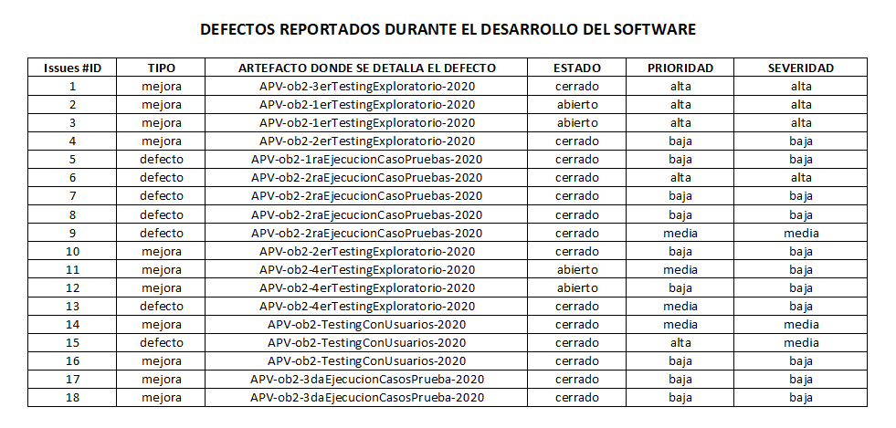

Analizando la aplicación, pudimos encontrar defectos en todos los puntos de la rubrica, gracias a la aplicación de diversas técnicas de ingeniería de software. 

Una de las limitantes que tuvimos fue el factor tiempo, por lo que se puede apreciar que muchos de los análisis no cuentan con la profundidad que debería corresponder, pero entendemos que asegurar la calidad del software es una tarea muy compleja y requiere de práctica y fuertes conocimientos en ingeniería de software, pero es un esfuerzo que a lo largo de la vida del software ahorra tiempo y dinero al hacer mucho mejor de mantener el software.

Tampoco nos podemos olvidar de los usuarios que van a utilizar nuestro sitio, todo el esferzo debe estar enfocado hacia ellos para poder captar su atención y que la experiencia sea satisfactoria (usabilidad) y que sea posible abarcar el mayor público posible (usabilidad).

# 9. TRABAJO DEL EQUIPO 

Durante el proceso de elaboración del presente trabajo, se evidenciaron cuatro etapas, que si bien se fueron superponiendo, fueron marcadas, las etapas fueron las siguientes:

- La "bajada a tierra" de la letra:

    - En esta etapa se contó con varias reuniones de planificación y de verificar cómo se pretendía llevar a cabo al proyecto, se tuvo una idea del alcance del mismo y de las etapas posteriores, se verificaron los fuertes de cada integrante del equipo y se generaron roles para administrar el tiempo y actividades. Si bien los roles fueron flexibles dependiendo la etapa, se mantuvo durante el tiempo de trabajo (Alonso desarrollo, Vera tester, Palma gestor del proyecto).

- Desarrollo:

    - La etapa de desarrollo empezó con la creación de la estructura de la aplicación por parte de Valeria Vera, luego se decidió cambiar de la utilización de css a scss, con lo que llevó una reestructura. En esta etapa se contó con la codificación por parte de todos los integrantes del equipo luego de una restructuración generada por Federico Alonso, se marcó una estructura y se dividieron las tareas.

- Testing:

    - En esta etapa Valeria Vera utilizó la experiencia personal para que, junto con lo aprendido en clase guiar al equipo en lo referente a la aplicación de las pruebas necesarias para evaluar el proyecto. Cristian Palma junto con Valeria Vera dividieron el trabajo para el correcto funcionamiento del equipo.

- Documentación:

    - La documentación fue parte de todos los integrantes del equipo, lo que llevó a que Cristian Palma tuviera que establecer un control y estandarización de los mismos antes de armar el documento final con partes de todo lo estudiado previamente.

# 10. REFLEXIÓN 

A lo largo del proceso de generar el obligatorio obtuvimos el valor de realizarle las pruebas tanto al código como el trabajo de testing. Ciertamente no es la misma la aplicación antes y después de realizar el testing.

En cuanto a la calidad de código, se evidencia que aplicar políticas de estandarización de la codificación no sólo ayuda a trabajar en equipo, sino que soluciona posibles errores en el sistema, además de corregir el código para que los navegadores no tengan problema para entender los mismos.

Tener pruebas unitarias ayuda en cuanto a la reestructuración de código y la modificación de clases. Aprendimos que el tiempo ocupado en elaborar las pruebas, es luego ahorrado en la solución de problemas. Aparte le brinda confiabilidad al sistema, ya que con las pruebas de usuario aprendimos que no todos los usuarios se percatan de todos los problemas.

En cuanto a la interfaz de usuario, pruebas de aceptabilidad y usabilidad, aprendimos a utilizar herramientas existentes para realizar las pruebas. Se aprendió a su vez de dónde buscar los estándares que aplican a la vista en navegador. Nos percatamos de errores que ocurren por no dar importancia a la relevancia de los botones y sus funciones. Errores que se evidenciaron luego en el testing funcional. Instancia en la cual nos dimos cuenta de que es importante una visión desde "fuera" o "arriba", dejando de lado que fuimos nosotros quienes creamos el sistema, para realizar pruebas mas objetivas.

Aplicando técnicas de testing funcional fue que pudimos detectar una gran cantidad de issues en la aplicación. Fue de suma importancia esta etapa, ya que no sólo aprendimos a aplicar las técnicas, sino que también nos permitió investigar y poder alcanzar a ver las aplicaciones en general con una visión más crítica.

Lo que el trabajo de reporte de defectos logró, fue organizar todos los errores encontrados. Fue de suma importancia aplicar un estandar de elaboración, ya que seguir pasos y poner los puntos relevantes es mucho mejor a que cada integrante los documente a su criterio. Además, permitía seguir los pasos para reproducir el defecto y luego es más sencillo corregirlo.

Para finalizar, nos queda la experiencia de llevar a cabo una aplicación de pequeño porte y testearla. Nos llevamos una idea de el tiempo que conlleva cada etapa del trabajo realizado, así como el conocimiento de todas las herramientas que ayudan a realizar una aplicación fiable y consistente. Si bien por razones de tiempo no se pudo realizar una aplicación estéticamente correcta, ni completamente funcional, se evidenció todo el proceso que debe acompañar y que debe pasar la misma. Al contrario del obligatorio anterior, en este caso si pudimos testear lo creado con usuarios reales, lo cual fue una valiosa experiencia, y ayudó a aislarnos del hecho de que fuimos nosotros quienes creamos la aplicación y poder dejar el orgullo de lado para ver la misma de forma objetiva.