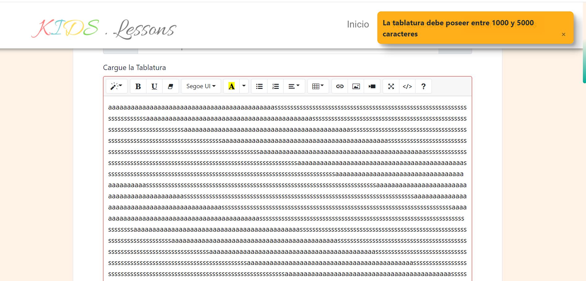
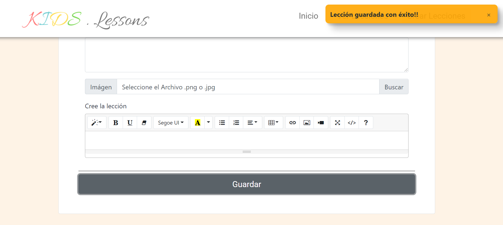
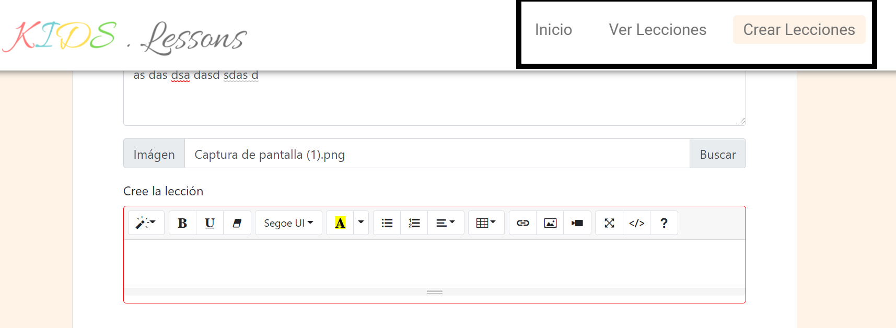

# PRUEBAS CON USUARIOS

A continuación se analizarán las pruebas con usuario y los resultados de las mismas.

## 1. PRUEBA CON USUARIOS

**Examinador**: Federico Alonso,

**Usuario**: Micaela Olivera,

**Prueba**: CU-1 Crear Canción,

**Puesta en escena**:

    - Usted es un profesor de guitarra que sube lecciones de guitarra online, una de las partes de esa lección es la canción, se desea que usted cree una canción para posteriormente asignarla a una lección.

**Observación**:

    - El usuario tardó 12 segundos en llegar a la sección de crearLección.html, que fue el tiempo en familiarizarse con la página.
    - Entendió rápidamente la opción de seleccionar canción existente o crear canción, pero una vez completados los datos no sabía donde presionar para crearla, por lo que tuvo que ser guiada para ello.
    - Varias veces ocurrió el problema con el largo de la tablatura, ocurrió que el usuario no estaba pensando en colocar una tablatura real, sino que sólo intentaba rellenar los campos, además, la el mensaje de ayuda no cumplía correctamente su función (no decía si faltaban o sobraban caracteres). [Issue #14](https://github.com/ORT-FIS-202008/ob2-ort-fis-obl2-alonso-palma-vera/issues/14), creado a partir de esta prueba.

**Tiempo**: 4 minutos 27 segundos.

**Examinador**: Federico Alonso,

**Usuario**: Micaela Olivera,

**Prueba**: CU-2 Crear Lección,

**Puesta en escena**:

    - Siguiendo con el ejercicio anterior, cree una lección para la canción que acaba de crear.

**Observación**:

    - Contando con la experiencia anterior, el usuario cometió un error y luego siguió los mensajes de la aplicación.
    - Al finalizar se genera el mensaje de lección generada con éxito, pero no en el color verde correspondiente. [Issue #16](https://github.com/ORT-FIS-202008/ob2-ort-fis-obl2-alonso-palma-vera/issues/16)

**Tiempo**: 45 segundos.

**Examinador**: Federico Alonso,

**Usuario**: Micaela Olivera,

**Prueba**: CU-3 Ver Lección,

**Puesta en escena**:

    - Siguiendo con el ejercicio anterior, vea una lección en la página.

**Observación**:

    - Luego de realizada la lección, no se habilitaba la navegación en la página. [Issue #15](https://github.com/ORT-FIS-202008/ob2-ort-fis-obl2-alonso-palma-vera/issues/15), creado a partir de esta prueba.

**Tiempo**: 12 segundos.

### 1.1. CONCLUSIONES DE LA PRUEBA

La puesta en escena no fue clara, se debe especificar mejor y darle los requerimientos para completar la misma, ejemplo una tablatura para pegar, y una lección para colocar en el campo correspondiente. Surgieron issues a partir de dichas pruebas, lo cual fue conveniente para la mejora de la aplicación.

## 2. SEGUNDA PRUEBA CON USUARIOS

**Examinador**: Cristian Palma,

**Usuario**: Ruben Almeida,

**Prueba**: CU-1 Crear Canción,

**Puesta en escena**:

    - Usted es un profesor de guitarra que sube lecciones de guitarra online, una de las partes de esa lección es la canción, se desea que usted cree una canción para posteriormente asignarla a una lección. Además, en pestañas abiertas se encuentra una tablatura y en el escritorio del ordenador cuenta con un archivo .mp3 correspondiente a la canción.

**Observación**:

    - El usuario tardó unos segundos en llegar a la sección de crearLección.html, que fue el tiempo en familiarizarse con la página, primero buscó la palabra canción y al no encontrarla, leyó nuevamente la letra y seleccionó la opción correcta.
    - Algo similar sucedió al ver el formulario, tardó unos segundos en ver el botón crear nueva canción.
    - Una vez en el formulario, tuvo problemas con el largo de la tablatura, pero entendió como solucionarlos gracias al texto de error que contenía un contador de caracteres.

**Tiempo**: 3 minutos 19 segundos.

**Examinador**: Cristian Palma,

**Usuario**: Ruben Almeida,

**Prueba**: CU-2 Crear Lección,

**Puesta en escena**:

    - Siguiendo con el ejercicio anterior, cree una lección para la canción que acaba de crear. En una pestaña abierta tiene una clase preparada, y en el escritorio una imágen.

**Observación**:

    - Contando con la experiencia anterior, el usuario se dió cuenta de que la canción estaba en el select seleccionada.
    - 

**Tiempo**: 1 minuto 02 segundos.

**Examinador**: Cristian Palma,

**Usuario**: Ruben Almeida,

**Prueba**: CU-3 Ver Lección,

**Puesta en escena**:

    - Siguiendo con el ejercicio anterior, vea una lección cualquiera en la página.

**Observación**:

    - El usuario no tuvo problema en ir a ver lecciones y seleccionar una para ver.

**Tiempo**: 12 segundos.

### 2.1. CONCLUSIONES DE LA PRUEBA

La mejora en la puesta en escena tuvo el resultado esperado, el usuario entendió lo que ocurría en la pantalla. La tablatura de la canción da problemas, pero ahora se solucionan de una forma más rápida debido a que los mensajes son más claros.