# TESTING FUNCIONAL 

Para el desarrollo de esta etapa, se utilizaron técnicas de prueba de caja negra, los casos de prueba se derivaron de la especificación del programa.
Se ejecutaron sesiones de testing exploratorio como primera instancia para familiarizarse con el sistema y encontrar la mayor cantidad de defectos y mejoras de usabilidad.
Para la planificación se utilizó la técnica **Pruebas de caso de Uso** 
En esta segunda intancia se realiza una suite de pruebas, para cubrir los aspectos más funcionales del sistema. Se contruyen las suites aplicando a partir de los casos de uso del sistema y se aplica el método de clases de equivalencia para lograr una cobertura mayor del sistema en general.

## Generación de Casos de Prueba 

**CASOS DE USO**

#### CU1: FUNCIONALIDAD CREAR LECCIÓN

Precondiciones: 
- 1. Debe de existir al menos una canción precargada.

Curso básico:
- 1. El usuario ingresa al sistema.
- 2. El usuario se dirige a la pantalla Crear Lecciones
- 3. El usuario elige una canción precargada en el sistema.
- 4. El usuario tipea un nombre de entre 5 y 10 caracteres.
- 5. El usuario tipea una descripción de entre 10 y 250 caracteres.
- 6. El usuario carga una imagen.
- 7. El usuario tipea la lección de entre 10 y 2000 caracteres.
- 8. El usuario selecciona guardar.
- 9. La lección se crea exitosamente.

Curso alternativo:
- 1. El usuario no selecciona una canción.
- 2. El usuario tipea un nombre inválido.
- 3. El usuario tipea una descripción inválida
- 4. El usuario carga una imagen inválida
- 5. El usuario tipea una lección inválida.

#### CU2: FUNCIONALIDAD CREAR CANCIÓN

Curso básico:
- 1. El usuario ingresa al sistema.
- 2. El usuario se dirige a la pantalla Crear Lecciones
- 3. El usuario selecciona la opción Crear Nueva Canción
- 4. El sistema despliega la opción de crear una nueva canción.
- 5. El usuario completa el campo Nombre de la canción
- 6. El usuario completa el campo Autor
- 7. El usuario carga un sonido.
- 8. El usuario completa el campo Tablatura

Curso alternativo:
- 1. El usuario tipea un nombre inválido.
- 2. El usuario tipea un autor inválido.
- 3. El tipea una tablatura inválida.
- 4. El usuario tipea un sonido inválido.

#### CU3: FUNCIONALIDAD REALIZAR LECCIÓN

Precondiciones: 
- 1. Debe de existir al menos una lección precargada.

Curso básico:
- 1. El usuario ingresa al sistema.
- 2. El usuario se dirige a la pantalla Ver Lecciones
- 3. El usuario visualiza todas las lecciones disponibles en pantalla (nombre, breve descripción e imagen asociada)
- 4. El usuario selecciona la opción Tomar Lección.
- 5. El sistema redirige al usuario a la pantalla de la lección.
- 6. El usuario visualiza el título y fecha de la lección
- 7. El usuario visualiza el titulo y autor de la canción.
- 8. El usuario escucha la música de la canción.
- 9. El usuario visualiza el instructivo de la lección.
- 10. El usuario visualiza la descripción de la lección.
- 11. El usuario sale de la lección.

### ESCENARIOS

#### FUNCIONALIDAD CREAR LECCIÓN

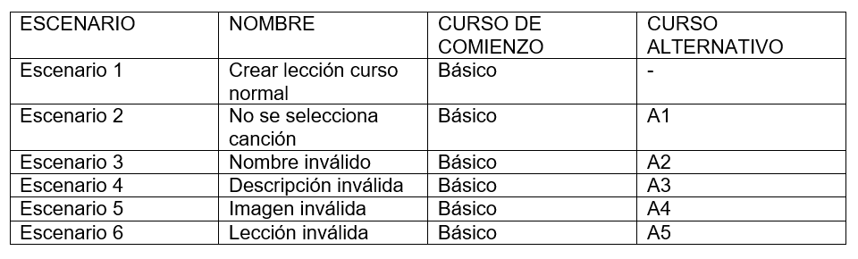

#### FUNCIONALIDAD CREAR CANCIÓN

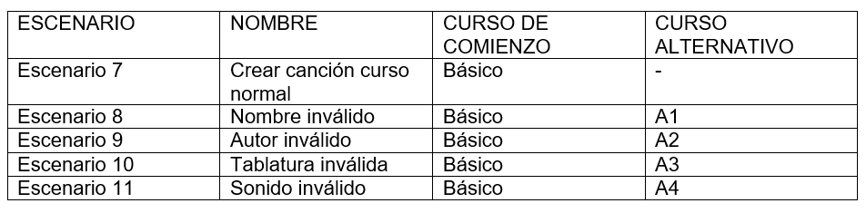

#### FUNCIONALIDAD REALIZAR LECCIÓN

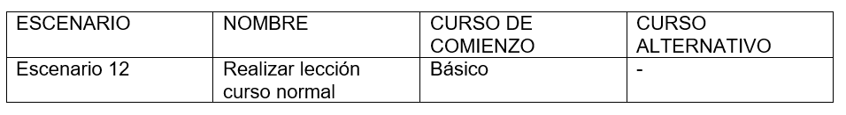

### CASOS DE PRUEBAS

#### FUNCIONALIDAD CREAR LECCIÓN

##### Identificación de variables de entrada:

- Nombre
- Descripción 
- Canción
- Ruta Imagen
- Lección

##### Clases de equivalencia

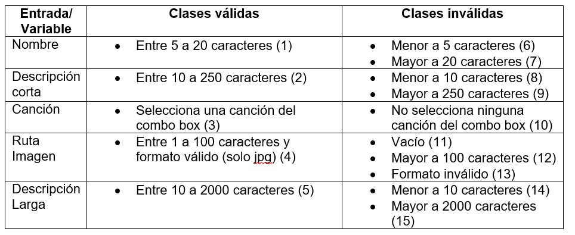

##### Casos de pruebas

#### FUNCIONALIDAD CREAR CANCIÓN

##### Identificación de variables de entrada:

- Nombre
- Tablatura
- Autor
- Ruta Sonido

##### Clases de equivalencia

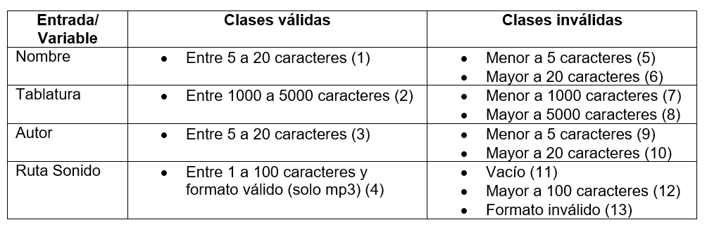

##### Casos de pruebas

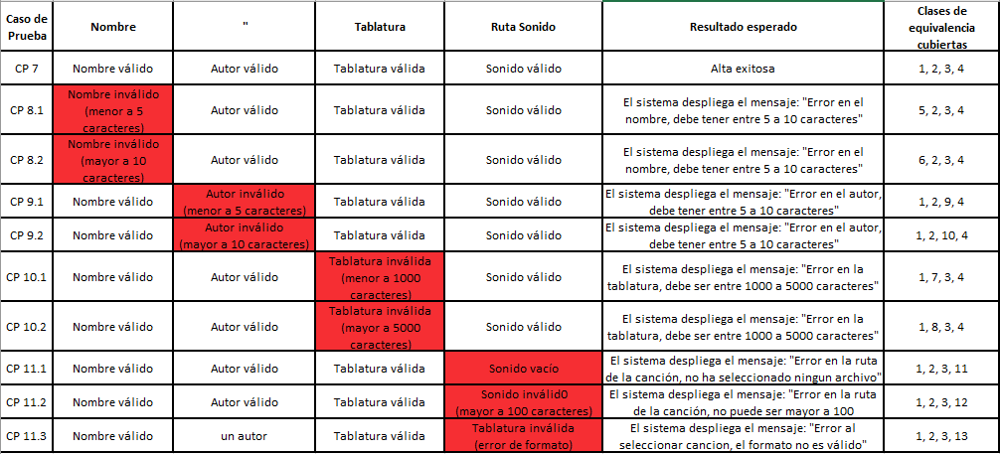

### FUNCIONALIDAD REALIZAR LECCIÓN

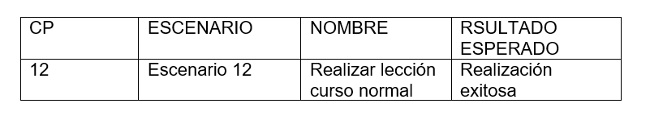

## TESTING EXPLORATORIO 

Se realizan cuatro sesiones de testing exploratorio debido a que el sistema es muy extenso por lo que no sería posible abarcarlo en una sola instancia y para permitirle a todos los integrantes del equipo familiarizarse con la interfaz.

### Primer sesión

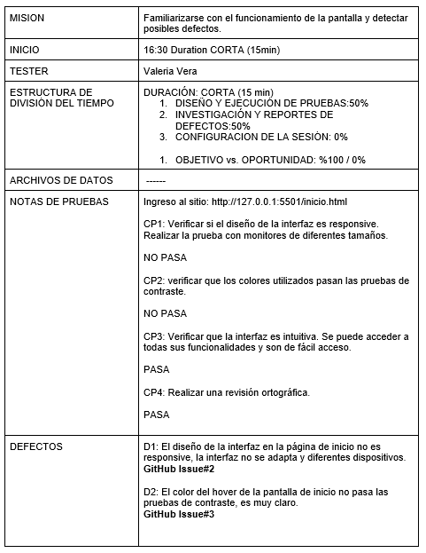

### Segunda sesión

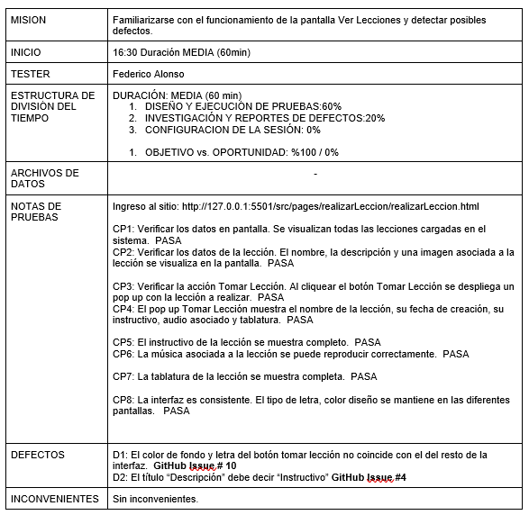

### Tercera sesión

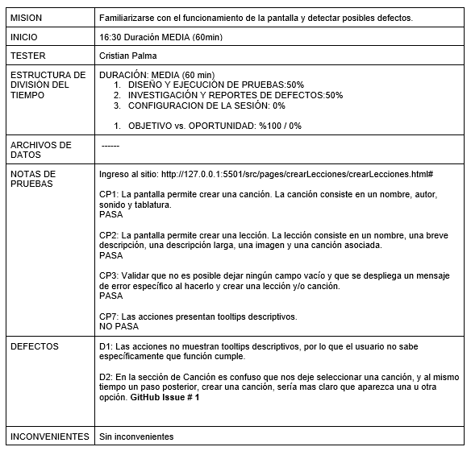

### Cuarta sesión

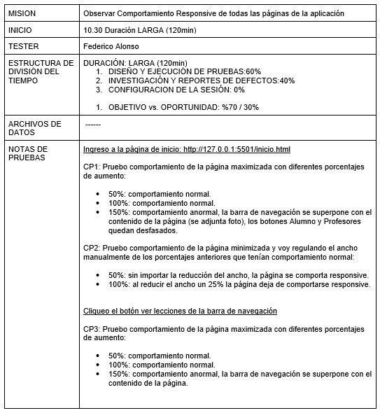

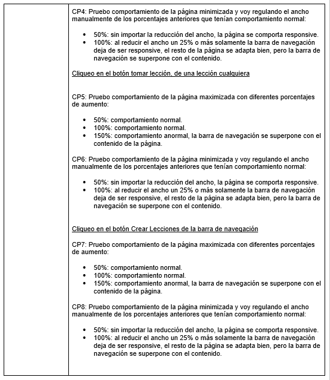

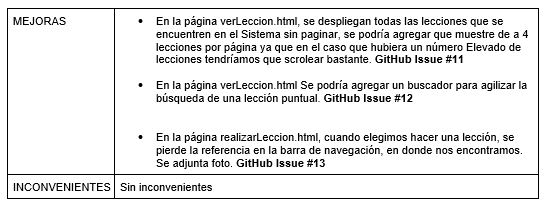

## EJECUCIÓN DE CASOS DE PRUEBA  

### Ejecución casos 1-6.2

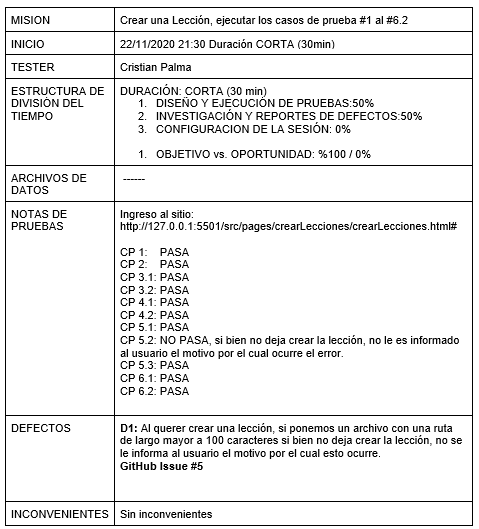

### Ejecución casos 7-11.3

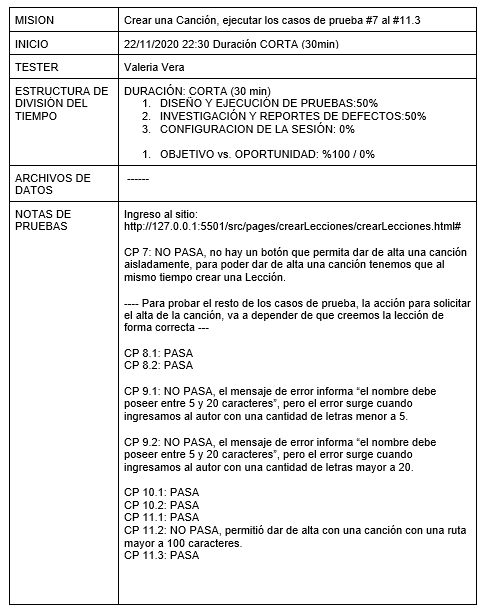

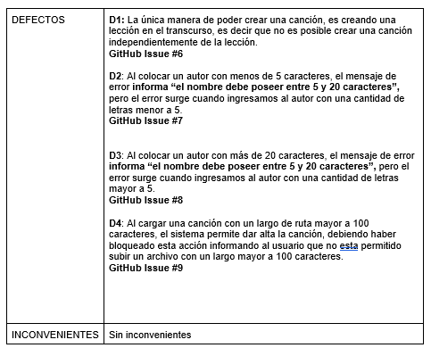

### Ejecución casos 7-11.3

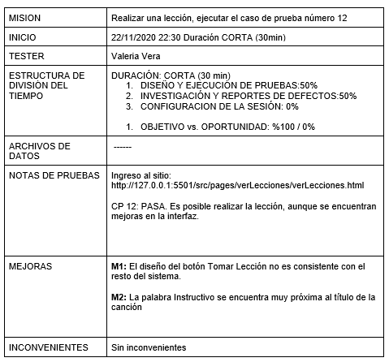
